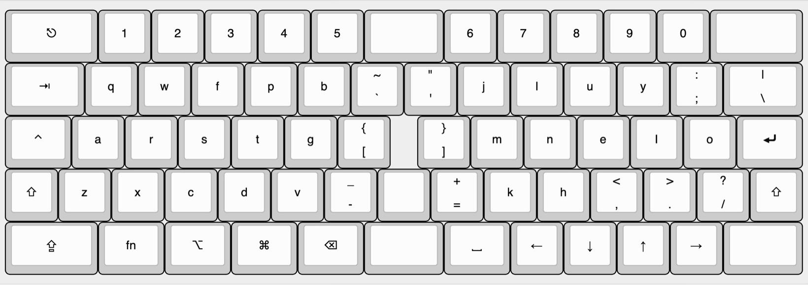
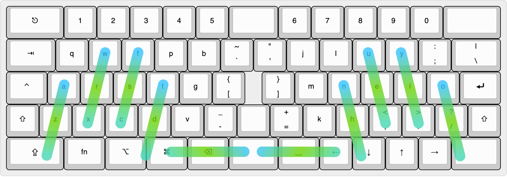
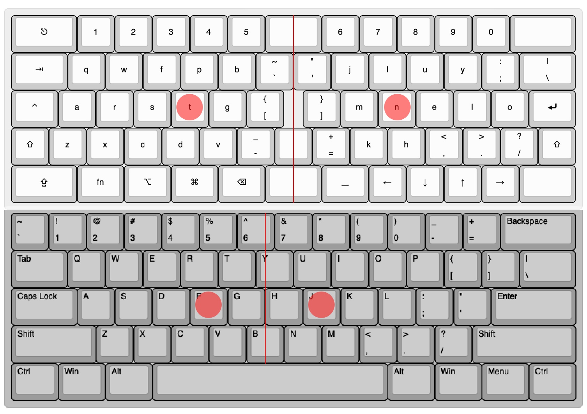
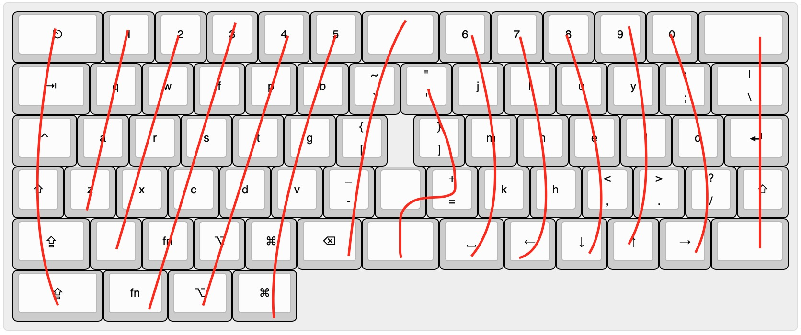

# Symmetric 60%

A staggered yet ergonomic 60% keyboard.

## Idea

A slightly ergonomic keyboard that fits into 60% form factor. 

 ## Featuring

* Staggered yet ergonmic 

* Maximize hand distance 

* Arrow keys are must.

* Fitts' law is respected. Four corner keys are maximized while [you shall no call its name] is break into 3 keys.  The gaint space bar is a huge waste ot thumb(s). It breaks into 1.25, 1.5, 1.25 to free it up. My favorite combination is, <kbd>backspace</kbd>, <kbd>enter</kbd>, <kbd>whitespace</kbd>.

* 60% form factor which should fix your notebook perfectly.

* all keys are under 1.75u which means no stablizer is required. Period.

##  Cons

It's incompatible to traditioal keycaps layout. **CAPS LOCK** is the only 1.75u key on traditional keyboard. In Symmetric 60%, 4 is required but you can always swap into smaller keycaps at your wish.

## Prior work

in the order of first appearance.

[Symmetric Stagger 60%]( https://geekhack.org/index.php?topic=66965.0)  by Jesse Vincent, Keyboardio  While I wait for the Model 01 boards to come back from Shenzhen, I've been messing around with a symmetric stagger 60% layout. Before I go and get 5 PCBs made, I'd love layout feedback from folks.

[SemiErgo](https://github.com/mtei/SemiErgo_Layout) by meti, 2017 March    I will vote it for ANSI standard without any doubt.

[Katana 60](https://deskthority.net/viewtopic.php?t=16287&start=30) by rominronin, 2017 Novenember. it's a beauty.  ps. the character in the middle is 刀 which means sword in Chinese and Japanese.

## Next

Now I am going to handwire one to refuse my point. Stay tune.

You can [try it on paper](assets/try_it.pdf) and [let me know](https://forms.gle/i4KZJjDPFTidD8Jt6) how to you think about Symmetric60.

## References

On space bar http://xahlee.info/kbd/keyboard_problems.html

Key symbols from http://xahlee.info/comp/unicode_computing_symbols.html

Mac keyboard shortcuts https://support.apple.com/en-us/HT201236

Human Engineering the Keyboard by K. H. Eberhard Kroemer
 Human Factors: The Journal of the Human Factors and Ergonomics Society 1972 14: 51 DOI: [10.1177/001872087201400110](
http://hfs.sagepub.com/content/14/1/51)